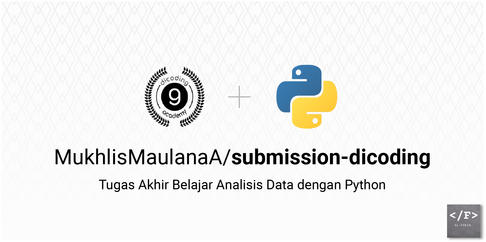

<h1 align="center">Submission Dicoding</h1>



This repository contains the final project submission for the Data Analytics learning path on the Dicoding platform. The project demonstrates proficiency in data analysis, visualization, and the use of web apps to present insights.

## **Libraries Used**
The following Python libraries are used in this project:

- **pandas**: Data manipulation and analysis
- **numpy**: Numerical operations on data
- **matplotlib**: Data visualization
- **seaborn**: Statistical data visualization
- **streamlit**: Building interactive web applications
- **folium**: Visualizing geospatial data
- **streamlit-folium**: Integrating Folium maps with Streamlit

## **Setup and Running the Project**

Follow these steps to set up the project in a virtual environment and run the Streamlit dashboard:

### 1. Clone the Repository
```bash
git clone https://github.com/MukhlisMaulanaA/submission-dicoding.git
cd submission-dicoding
```

### 2. Create and Activate a Virtual Environment

Using **VSCode** integrated terminal:

```bash
# Create virtual environment
python -m venv venv

# Activate the virtual environment
# On Windows:
venv\Scripts\activate
# On macOS/Linux:
source venv/bin/activate
```

### 3. Install Required Libraries

```bash
pip install -r requirements.txt
```

### 4. Run the Streamlit Dashboard

To launch the dashboard:

```bash
streamlit run dashboard/dashboard.py
```

Open the local server URL (e.g., `http://localhost:8501`) in your browser to interact with the app.

## **Contact**

Feel free to reach out with any questions or feedback:

- **Email**: [mukhlis.maulanaalf@gmail.com](mailto:mukhlis.maulanaalf@gmail.com)
- **LinkedIn**: [Mukhlisalf](https://www.linkedin.com/in/mukhlisalf/)
- **GitHub**: [MukhlisMaulanaA](https://github.com/MukhlisMaulanaA)

---

Happy Coding! 😊

